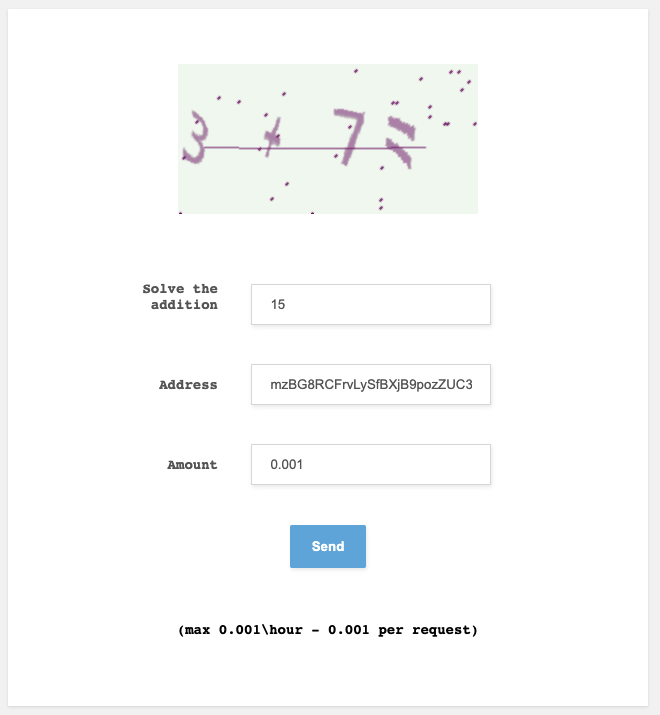

# Unit 19 - Multi-Blockchain Wallet in Python

------------------

## **Description:**

This is a hierarchical deterministic universal wallet built using Python that supports BIP32, BIP39, BIP44, and non-standard derivation paths for wallets.

To send transactions, the user must access the wallet.py and use the 'priv_key_to_account', 'create_tx', and 'send_tx' functions.  The priv_key_to_account function requires the user to pass to it the coin type for the transaction and private key of the sending address.  The create_tx function requires the user to pass it the coin type, the wallet where the funds are going, the public key of the sender, and the quantity of coin being sent.  The send_tx function requires the user to pass it the coin type, wallet where the funds are going, and the quantity of coin being sent.

Once the correct details are entered into the functions, the user can then execute the code in wallet.py using Terminal.

## **Test Transactions:**

### **BTC Transaction**

Screenshot of the BTCTEST address being funded using a faucet:

Screenshot from a block explorer of the BTCTEST address balance after being funded:

Screenshot of the code in wallet.py that was used to send BTCTEST from one address to another.

Here is a screenshot of a successful transaction completed between two of BTCTEST addresses using the Python code I wrote in wallet.py:

### **ETH Transaction**

Unfortunately, there were several issues that I encountered when trying to attempt the ETH Transactions.  There were issues with prefunding the ETH account as well as issues with MyCrypto connections.  I attended office hours to receive help with these issues, but neither the TA nor other students were able to solve it either.  Therefore this part of the assignment was not completable.